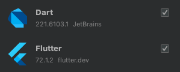
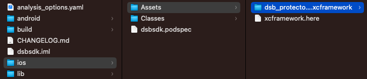
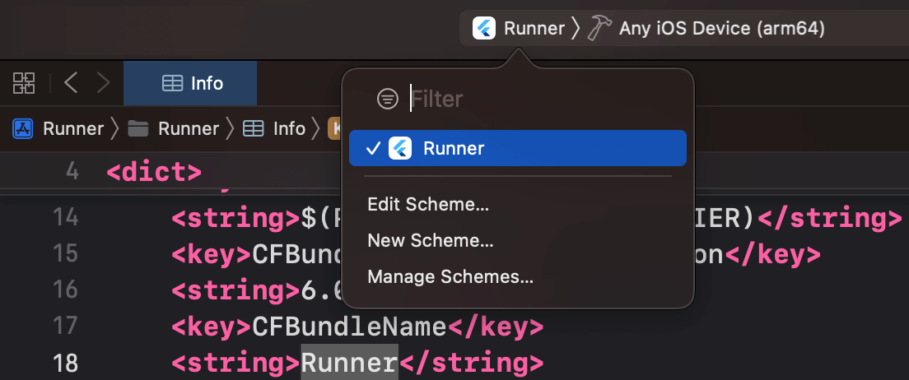
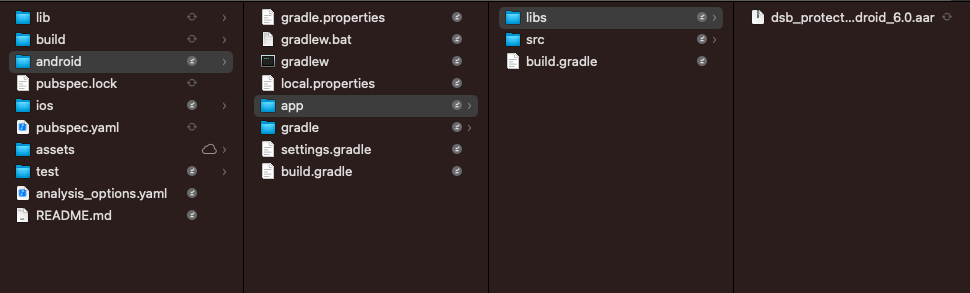
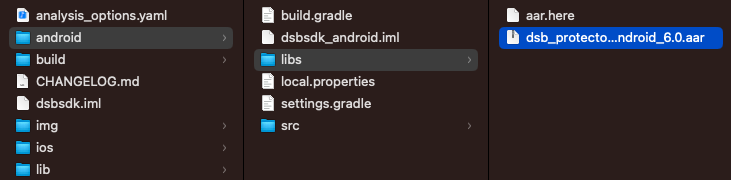
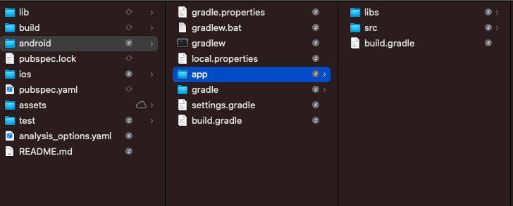

<picture style="display:block;float:none;margin-left:auto;margin-right:auto;width:60%">
    <source media="(prefers-color-scheme: dark)" srcset="./img/LogoDarkBackground.png">
    <source media="(prefers-color-scheme: light)" srcset="./img/LogoWhiteBackground.png" >
    
</picture>

# DSB-SDK: Flutter Integration

## Table Of Contents

<!-- TOC -->
* [DSB Library](#dsb-library)
* [DSB-SDK: Flutter Integration](#dsb-sdk--flutter-integration)
  * [Table Of Contents](#table-of-contents)
* [Disclaimer](#disclaimer)
* [Description](#description)
* [DSB-SDK Integration](#dsb-sdk-integration)
  * [Preliminary Steps](#preliminary-steps)
  * [Softwar versions used to develop the library](#softwar-versions-used-to-develop-the-library)
    * [Flutter](#flutter)
    * [Android Studio](#android-studio)
    * [Xcode](#xcode)
* [Set-up the library](#set-up-the-library)
  * [iOS](#ios)
    * [Install Cocoapods](#install-cocoapods)
    * [Troubleshooting](#troubleshooting)
  * [Android](#android)
    * [Copy aar to folders](#copy-aar-to-folders)
    * [Modify build.gradle](#modify-buildgradle)
    * [Additional configurations](#additional-configurations)
* [Implementing the DSB package](#implementing-the-dsb-package)
* [Implementation](#implementation)
    * [Init with licence and domain](#init-with-licence-and-domain)
      * [Parameters](#parameters)
      * [Response](#response)
      * [Error Table](#error-table)
      * [Example](#example)
    * [Get Device ID](#get-device-id)
      * [Response](#response-1)
      * [Example](#example-1)
    * [Send Login Data](#send-login-data)
      * [Parameters](#parameters-1)
      * [Response](#response-2)
      * [Example](#example-2)
  * [Device Protector API](#device-protector-api)
    * [Is Device Rooted](#is-device-rooted)
      * [Response](#response-3)
      * [Example](#example-3)
    * [Is Device on Insecure Network](#is-device-on-insecure-network)
      * [Error Table](#error-table-1)
      * [Response](#response-4)
      * [Example](#example-4)
    * [Is Device Hosts File Infected](#is-device-hosts-file-infected)
      * [Response](#response-5)
      * [Example](#example-5)
    * [Get Device Hosts File Infections](#get-device-hosts-file-infections)
      * [Response](#response-6)
      * [Example](#example-6)
    * [Restore Device Hosts File Infections](#restore-device-hosts-file-infections)
      * [Error Table](#error-table-2)
      * [Response](#response-7)
      * [Example](#example-7)
  * [Connection Protector API](#connection-protector-api)
    * [Is Secure By Risk Rules](#is-secure-by-risk-rules)
      * [Response](#response-8)
      * [Example](#example-8)
    * [Get Risk Rules Status](#get-risk-rules-status)
      * [Response](#response-9)
      * [Example](#example-9)
    * [Is Secure Certificate](#is-secure-certificate)
      * [Response](#response-10)
      * [Error Table](#error-table-3)
      * [Example](#example-10)
  * [Malware Protector API - Only Android](#malware-protector-api---only-android)
    * [Additional configurations](#additional-configurations-1)
    * [startOverlappingProtection](#startoverlappingprotection)
      * [Response](#response-11)
      * [Example](#example-11)
    * [setOverlayListener](#setoverlaylistener)
      * [Example](#example-12)
<!-- TOC -->

# Disclaimer

MIT License

Copyright (c) 2021 Appgate Cybersecurity, Inc.

Permission is hereby granted, free of charge, to any person obtaining a copy
of this software and associated documentation files (the "Software"), to deal
in the Software without restriction, including without limitation the rights
to use, copy, modify, merge, publish, distribute, sublicense, and/or sell
copies of the Software, and to permit persons to whom the Software is
furnished to do so, subject to the following conditions:

The above copyright notice and this permission notice shall be included in all
copies or substantial portions of the Software.

THE SOFTWARE IS PROVIDED "AS IS", WITHOUT WARRANTY OF ANY KIND, EXPRESS OR
IMPLIED, INCLUDING BUT NOT LIMITED TO THE WARRANTIES OF MERCHANTABILITY,
FITNESS FOR A PARTICULAR PURPOSE AND NONINFRINGEMENT. IN NO EVENT SHALL THE
AUTHORS OR COPYRIGHT HOLDERS BE LIABLE FOR ANY CLAIM, DAMAGES OR OTHER
LIABILITY, WHETHER IN AN ACTION OF CONTRACT, TORT OR OTHERWISE, ARISING FROM,
OUT OF OR IN CONNECTION WITH THE SOFTWARE OR THE USE OR OTHER DEALINGS IN THE
SOFTWARE.

<a name="desc"></a>

# Description

This repository is meant to help you understand the implementation of the native libraries of DSB-SDK using Flutter.
This repository reviews the initialization of the SDK and the following APIs: DEVICE_PROTECTOR_API, CONNECTION_PROTECTOR_API and MALWARE_PROTECTOR_API services.

Notice that all the methods of the SDK are accessed from the *Dsbsdk* class importing the package `package:dsbsdk/dsbsdk.dart`.

# DSB-SDK Integration

On this section, you can review step by step the integration of the SDK and its features.

[Preliminary steps](#prelim)

<a name="prelim"></a>

## Preliminary Steps

1. Install Android Studio
2. Install `Dart` and `Flutter` plugins for Android Studio:



3. [Download the Flutter SDK](https://docs.flutter.dev/get-started/install).
4. Add Flutter to the PATH environment to enable the use of Flutter doctor:

```bash
export PATH="$PATH:`pwd`/your/path/to/flutter-sdk/bin"
```

Run `flutter doctor` and check that you have installed evertything.

## Softwar versions used to develop the library

### Flutter 
Flutter 3.7.7
Tools • Dart 2.19.4 • DevTools 2.20.1

### Android Studio
Electric Eel | 2022.1.1
Dart Plugin: 221.6103.1
Flutter Plugin: 72.1.2

### Xcode
14.1

# Set-up the library

## iOS

Copy the required the `.xcframework` at the following location:



### Install Cocoapods

Follow the instructions to [install cocoaPods](https://guides.cocoapods.org/using/getting-started.html).

```bash
sudo gem install cocoapods
```

### Troubleshooting

* If you don't see the incidents generated by an iOS device in the DSB Customer Portal Activity page, check that the field `CFBundleName` from the `Info.plist` matches the same name of your main target:



## Android

### Copy aar to folders

Copy the required the `.aar` at the following locations:

`yourapp/android/app/libs`



`fp-rba-dsbsdk-example-flutter-wrapper/android/libs`



### Modify build.gradle 



in your app go to app/build.gradle and dependencies block add this line

```
implementation fileTree(include: ['*.aar'], dir: 'libs')
```
### Additional configurations
in the manifest add the permission
```xml
<uses-permission
        android:name="android.permission.HIGH_SAMPLING_RATE_SENSORS"
        tools:ignore="HighSamplingRate" />
```
The `android.permission.HIGH_SAMPLING_RATE_SENSORS` permission allows an application to access the high-frequency sensors of the Android device, which can improve the accuracy and speed in detecting changes in the position and orientation of the device.


```xml
<uses-permission android:name="android.permission.INTERNET"/>
```

The `android.permission.INTERNET` permission allows an application to access the internet on the Android device.

# Implementing the DSB package

Open a Flutter project using Android Studio, and add the reference of the library to `dependencies` in `pubspec.yaml`.

```yaml
dependencies:
    ...
    dsbsdk:
        path: ../fp-rba-dsbsdk-example-flutter-wrapper
```

This path is relative to the location of the wrapper within your application.

Run `pub get`:


And then using Terminal go to `/ios` folder from your application project and run `pod install`.

# Implementation

The first step is to initialize the library with a valid licence.

### Init with licence and domain

This is the standard initialization where the SDK points the Appgate servers directly.
It validates the license with the DSB server, downloads the latest available information and initializes the SDK library.

#### Parameters

* String LICENCE.
* String DOMAIN (optional).

#### Response

```dart
Future<void>
```

Any error code will be sent in the `catch` block as a `AppgateSdkError` object.

#### Error Table
These errors are encapsulated by code in the table below:

| Code | iOS                                    | Android                                  |
|------|----------------------------------------|------------------------------------------|
| 100  | DSBLicensingError                      | LicensingErrorException                  |
| 101  | DSBConnectionToDSBServerFailed         | ConnectionToDSBServerCannotBeEstablished |
| 104  | DSBSDKInitializationFailure            | SDKNotInitializedException               |
| 105  | DSBServerAuthenticityFailed            | DSBServerAuthenticationFailed            |
| 106  | DSBFailedToRetrieveRiskRules           | FailedToRetrieveRiskRules                |
| 107  | DSBFailedToRetrieveApplicationLists    | FailedToRetrieveApplicationLists         |
| 99   | DefaultError                           | DefaultError                             |


Errors only on Android

| Code | Error                              |
|------|------------------------------------|
| 109  | DSBListVersionInvalid              |
| 110  | MessageMonitoringBroadcastNotFound |
| 111  | MessageMonitoringException         |
| 112  | MessageReceivedBroadcastNotFound   |
| 113  | MissingManifestPermission          |
| 114  | ParseMessageIntentError            |
| 115  | UserDeniedPermissions              |


#### Example

```dart
import 'package:dsbsdk/dsbsdk.dart';
import 'package:dsbsdk/common/AppgateSDKError.dart';

Dsbsdk.initWithLicense("MY-VALID-LICENCE-STRING")
.then((_) {
}).catchError((error) {
    var errorDescription = "";
    if (error is AppgateSdkError) {
        errorDescription = "${error.code} ${error.message}";
    }
    print(errorDescription);
});
```

The domain value is optional, so you can add this property or not.

```dart
Dsbsdk.initWithLicense(LICENCE).then((_) {})

Dsbsdk.initWithLicense(LICENCE, CUSTOM_DOMAIN).then((_) {})
```

### Get Device ID

This method ensures the generation of a unique identifier, to establish communication between the DSB Server and the
device. To do this, the method uses the unique characteristics of hardware and software on each device.

#### Response

```dart
Future<String>
```

#### Example

```dart
Dsbsdk.getDeviceID()
.then((deviceID) {
    print(deviceID);
})
```

### Send Login Data

The SDK sends successful login information, according to company policies, to be consulted in the Appgate Customer
Portal event. The information could be encrypted, according to Appgate Customer Portal configuration.

This is a `void` method that sends custom information from the customer to identify the device usage.

#### Parameters

* Map<String, String> JSON object with any number of attributes.

#### Response

```dart
void
```

#### Example

```dart
import 'package:dsbsdk/dsbsdk.dart';

Dsbsdk.sendLoginData({
    "email": "example@mydomain.com",
    "example": "123",
    "extra1": "You can send",
    "extra2": "Any number of custom parameters"
})
```

## Device Protector API

### Is Device Rooted

This method tells if the device has been rooted in Android or has Jailbreak in iOS.

#### Response

```dart
Future<bool>
```

#### Example

```dart
import 'package:dsbsdk/dsbsdk.dart';

Dsbsdk.getDeviceProtectorAPI()
.isDeviceRooted()
.then((value) {
    print("isDeviceRooted: $value");
})
```

### Is Device on Insecure Network

This method tells if the device is connected to a private network. This works for Android, for iOS it will always return `false`.

#### Error Table
These errors are encapsulated by code in the table below:

| Code | iOS                                    |
|------|----------------------------------------|
| 98   | PlatformError                          |

#### Response

```dart
Future<bool>
```

#### Example

```dart
import 'package:dsbsdk/dsbsdk.dart';
import 'package:dsbsdk/common/AppgateSDKError.dart';

Dsbsdk.getDeviceProtectorAPI()
.isDeviceOnInsecureNetwork()
.then((value) {
    print("isDeviceOnInsecureNetwork: $value");
})
.catchError((error) {
    var errorDescription = "";
    if (error is AppgateSdkError) {
        errorDescription = "${error.code} ${error.message}";
    }
    print(errorDescription);
});
```

### Is Device Hosts File Infected

Call this method to analyze the current health of Hosts file of the device in search of possible malicious entries.
This method returns if the Host File has been injected with infections.

#### Response

```dart
Future<bool>
```

#### Example

```dart
import 'package:dsbsdk/dsbsdk.dart';

Dsbsdk.getDeviceProtectorAPI()
.isDeviceHostsFileInfected()
.then((value) {
    print("isDeviceHostsFileInfected: $value");
})
```

### Get Device Hosts File Infections

If there is Hosts file infection this method will return the malicious IP with the corresponding compromised Hosts for the IP.
If the previous method `isDeviceHostsFileInfected()` has returned `true`, this method will tell the details about the infections.

#### Response

```dart
Future<Map>
```

#### Example

```dart
import 'package:dsbsdk/dsbsdk.dart';

Dsbsdk.getDeviceProtectorAPI()
.getDeviceHostsFileInfections()
.then((infections) {
    print(infections);
})
```

### Restore Device Hosts File Infections

This method will restore the Hosts file to its factory default values to eliminate any Pharming attacks on the device.
If the previous method `isDeviceHostsFileInfected()` has returned `true`, this method restores the host file on Android.

#### Error Table
These errors are encapsulated by code in the table below:

| Code | iOS                                    |
|------|----------------------------------------|
| 98   | PlatformError                          |

#### Response

```dart
Future<void>
```

#### Example

```dart
import 'package:dsbsdk/dsbsdk.dart';
import 'package:dsbsdk/common/AppgateSDKError.dart';

 Dsbsdk.getDeviceProtectorAPI()
    .restoreDeviceHosts()
    .then((_) {
    print("file restored");
})
.catchError((error) {
    var errorDescription = "";
    if (error is AppgateSdkError) {
        errorDescription = "${error.code} ${error.message}";
    }
    print(errorDescription);
});
```

## Connection Protector API

### Is Secure By Risk Rules

Analyzes whether it is safe to use the device to establish any connection, based on rules defined in the Appgate
Customer Portal.
This method tells if the Device is protected by de defined Risk Rules in the DSB Admin console.

#### Response

```dart
Future<bool>
```

#### Example

```dart
import 'package:dsbsdk/dsbsdk.dart';

Dsbsdk.getConnectionProtectorAPI()
.isSecureByRiskRules()
.then((value) {
    print("isSecureByRiskRules: $value");
})
```

### Get Risk Rules Status

This method returns an object with the results of the validation of the Risk Rules, through a Boolean that determines
whether the device is safe based on the Risk Rules and a snapshot of the status of the Rules on the device.

If the previous method has returned that is not secure by the active rules, this method will provide the details of what
Rules has failed at the analysis.

#### Response

```dart
Future<RiskRulesStatus>

RiskRulesStatus {
    bool isSecureByRiskRules;
    Map riskRulesStatus;
}
```

#### Example

```dart
import 'package:dsbsdk/dsbsdk.dart';

Dsbsdk.getConnectionProtectorAPI()
.getRiskRulesStatus()
.then((status) {
    print("isSecureByRiskRules: ${status.isSecureByRiskRules}");
    final map = status.riskRulesStatus;
    final appIntegrity = map["appIntegrity"];
    if(appIntegrity is bool) print("appIntegrity: $appIntegrity");
    final isSimulator = map["isSimulator"];
    if(isSimulator is bool) print("isSimulator: $isSimulator");
    final pharmingInfected = map["pharmingInfected"];
    if(pharmingInfected is bool) print("pharmingInfected: $pharmingInfected");
    final rooted = map["rooted"];
    if(rooted is bool) print("rooted: $rooted");
    final isDeviceFaceDown = map["isDeviceFaceDown"];
    if(isDeviceFaceDown is bool) print("isDeviceFaceDown: $isDeviceFaceDown");
    final debugModeEnable = map["debugModeEnable"];
    if(debugModeEnable is bool) print("debugModeEnable: $debugModeEnable");
    final unknownSourcesEnable = map["unknownSourcesEnable"];
    if(unknownSourcesEnable is bool) print("unknownSourcesEnable: $unknownSourcesEnable");
})
```

### Is Secure Certificate

This method makes a certificate pinning validation to the URL in a separate connection in order to determine whether
Certificate Spoofing currently exists. If the validation is successful, it allows the connection to the bank servers.

This method tells if the certificate for the given URL is secure.

#### Response

```dart
Future<bool>
```

Any error code will be sent in the `catch` block as a `AppgateSdkError` object.

#### Error Table
These errors are encapsulated by code in the table below:

| Code | iOS                                    | Android                                  |
|------|----------------------------------------|------------------------------------------|
| 102  | DSBUnableToExtractPinsFromCertificates | CannotExtractPinsFromCertificates        |
| 103  | DSBUnableToGetCertificatesFromURL      | CannotGetCertificatesFromURL             |
| 108  | DSBMalformedURL                        | MalformedURL                             |
| 99   | DefaultError                           | DefaultError                             |
| 98   | PlatformError                          |                                          |

Errors only on Android

| Code | Error                              |
|------|------------------------------------|
| 109  | DSBListVersionInvalid              |
| 110  | MessageMonitoringBroadcastNotFound |
| 111  | MessageMonitoringException         |
| 112  | MessageReceivedBroadcastNotFound   |
| 113  | MissingManifestPermission          |
| 114  | ParseMessageIntentError            |
| 115  | UserDeniedPermissions              |

#### Example

```dart
import 'package:dsbsdk/dsbsdk.dart';
import 'package:dsbsdk/common/AppgateSDKError.dart';

String url = "https://example.com";
Dsbsdk.getConnectionProtectorAPI()
.isSecureCertificate(url)
.then((value) {
    print("isSecureCertificate: $value");
})
.catchError((error) {
    var errorDescription = "";
    if (error is AppgateSdkError) {
        errorDescription = "${error.code} ${error.message}";
    }
    print(errorDescription);
});
```
## Malware Protector API - Android only

### Additional configurations

Due to operating system restrictions, overlay attacks were only possible up to Android 5, the standard implementation of the SDK prevents possible overlay attacks up to Android 6. However, if you want to extend the overlay protection for Android 7 to 10, follow the instructions below:
1. Add the following permission on the application manifest:

```xml
<uses-permission xmlns:tools="http://schemas.android.com/tools" 
                 android:name="android.permission.PACKAGE_USAGE_STATS" 
                 tools:ignore="ProtectedPermissions"/>
```
2. Prompt the userbase of those devices to activate the “Usage access” permission for the application.
If you want to extend this protection up to Android 11, in addition to the previous steps, do the following:
   1. Add the following permission to the manifest:
   ```xml
    <uses-permission android:name="android.permission.QUERY_ALL_PACKAGES"/>
    ```
   2. Ask for the approval of this permission from Google Play by filling up the Permission Declaration Form, since it is a sensitive permission. 


### startOverlappingProtection

Call this method to start the protection against app overlapping.

Initiates protection against overlay attacks.

#### Response

```dart
Future<bool>
```
Any error code will be sent in the `catch` block as a `AppgateSdkError` object.

#### Error Table
These errors are encapsulated by code in the table below:

| Code | iOS                                    |
|------|----------------------------------------|
| 98   | PlatformError                          |


#### Example

```dart
import 'package:dsbsdk/dsbsdk.dart';
import 'package:dsbsdk/common/AppgateSDKError.dart';

Dsbsdk.getMalwareProtectorAPI()
.startOverlappingProtection()
.then((data) {
    print("startOverlappingProtection: $data");
}).catchError((error) {
    var errorDescription = "";
    if (error is AppgateSdkError) {
        errorDescription = "${error.code} ${error.message}";
    }
    print(errorDescription);
});
```
### setOverlayListener

The OverlayListener class contains the onSuspiciousOverlay method that notifies of any attempted Overlay attack.
This method creates the Listener to get information about an application that is detected trying to perform an Overlay attack.

>   Note:
    This method works only on Android, when used on iOS it will never call the listener.

#### Example
```dart
import 'package:dsbsdk/dsbsdk.dart';

Dsbsdk.getMalwareProtectorAPI()
.setOverlayListener((overlappingApp) {
    print(overlappingApp);
});
```
